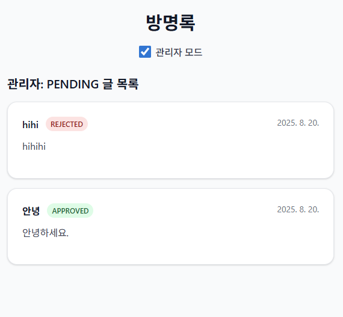
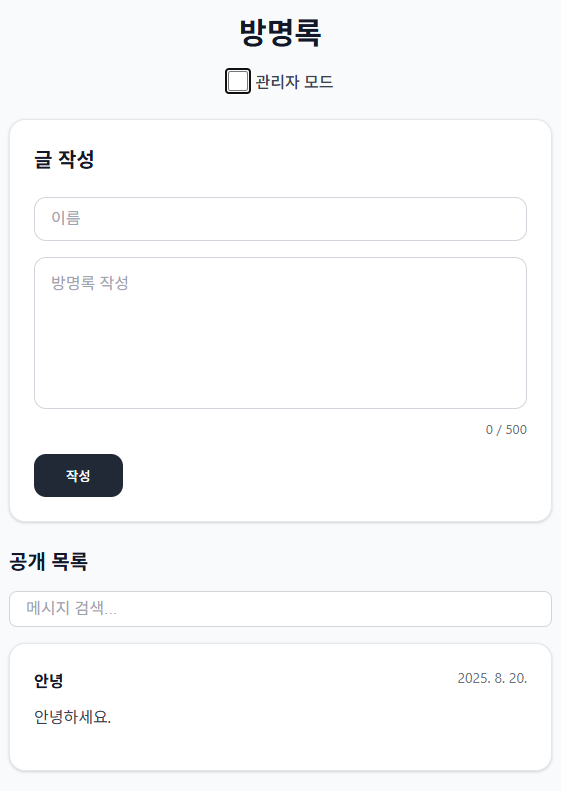

# Guestbook Frontend

### **FE (React + Vite + TypeScript)**

## 1. 프로젝트 소개
관리자 승인 기능이 추가된 간단한 방명록 서비스
사용자는 글 작성, 관리자는 글을 승인/거절/삭제할 수 있으며, 승인된 글만 공개 목록에 표시됩니다.

## 2. 환경 설치/실행 방법
백엔드 서버
https://3163f0d2-35ec-46f1-b957-a9c692b9d0a1-00-6h53kt82dewp.pike.replit.dev/

## 3. 주요 기능
사용자 화면
- 글 작성 폼
  - 이름 입력(30자 이하) / 메시지 입력(500자 이하)
  - 글 작성 시 상태 : PENDING
  - 작성 완료 후 안내 메시지 표시 : "관리자 승인을 기다려주세요"
- 공개 글 목록 페이지
  - 승인된 글(APPROVED)만 표시
  - 메시지 검색 기능
  - 페이지네이션 : 한 페이지에 5개씩 표시, 총 페이지 수 자동 계산
  - 최신 글이 상단에 표시
관리자 화면
- 상단 체크박스로 일반화면 <-> 관리자 화면 전환
- PENDING 글 관리
  - 모든 글(승인/거절/대기) 표시
  - 상대 배지 표시(PENDING/APPROVED/REJECTED)
- 페이지 네이션

## 4. 화면

